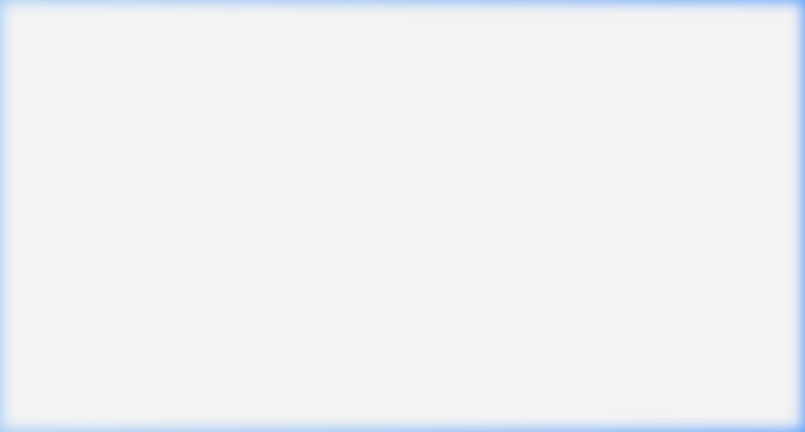
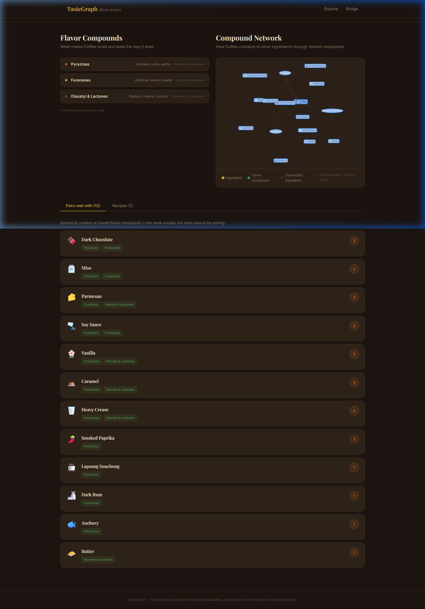
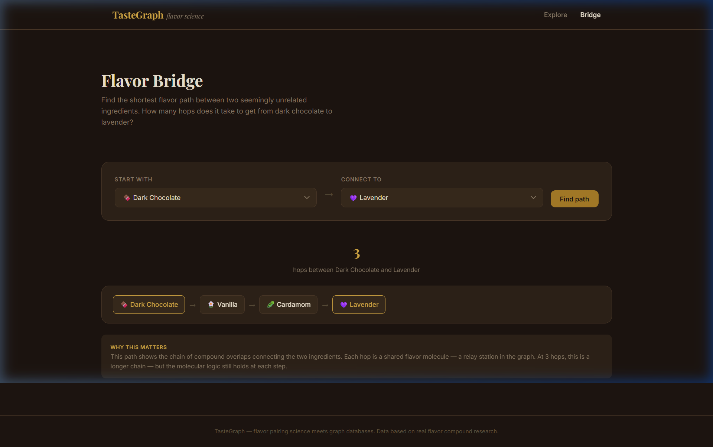
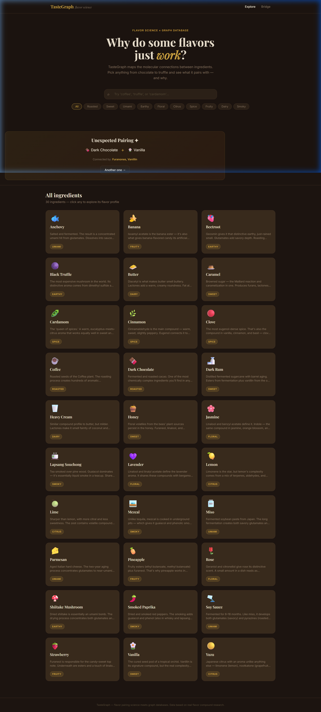

# TasteGraph

A flavor pairing explorer — built on real food science and a graph database.

**[Live demo →](https://tastegraph.vercel.app)** | [Screen recording](#)

---

## What is this?

TasteGraph maps the molecular connections between ingredients. Pick anything from coffee to truffle, and it'll show you what pairs well with it — and *why*, at the compound level.

This isn't a recipe recommendation engine. It's more like a map of flavor space.

The core insight: ingredients pair well when they share aromatic molecules called *volatile compounds*. Dark chocolate and coffee share pyrazines (from roasting). Cardamom and lavender share linalool (a floral terpene). That's why a cardamom rose latte isn't weird — it's just two linalool-rich ingredients in a cup.

This idea is based on the **flavor pairing hypothesis** explored in Yong-Yeol Ahn's 2011 paper *"Flavor network and the principles of food pairing"* (Scientific Reports).

---

## Why a graph database?

The flavor compound relationships are genuinely graph-shaped data. Every ingredient is a node, every shared compound is a potential edge. The interesting questions are all about connections:

- *Which ingredients share the most compounds with miso?* → 2-hop traversal
- *What's the shortest flavor path from dark chocolate to lavender?* → shortest path query
- *Are there clusters of ingredients that work across cultural boundaries?* → community detection

A relational schema would need a junction table (`ingredient_compounds`) and self-joins to answer any of these. The multi-hop traversal (`MATCH (a)-[:CONTAINS]->(fc)<-[:CONTAINS]-(b)`) is a single Cypher clause. The shortest path query is built into the graph engine.

CognoDB speaks openCypher over Bolt, so I used the official Neo4j JavaScript driver without modification.

---

## Data model

```
(Ingredient)-[:CONTAINS {amount: "dominant|moderate|trace"}]->(FlavorCompound)
(Ingredient)-[:PAIRS_WITH {score: int, sharedCompounds: [string]}]->(Ingredient)
(Recipe)-[:USES]->(Ingredient)
(Ingredient)-[:IN_CATEGORY]->(Category)
```

**Nodes:**

| Label | Key properties |
|-------|---------------|
| `Ingredient` | `id`, `name`, `description`, `emoji`, `origin` |
| `FlavorCompound` | `id`, `name`, `chemical_class`, `aroma_descriptor` |
| `Recipe` | `id`, `title`, `description`, `difficulty`, `why_it_works` |
| `Category` | `id`, `name` |

**Diagram:**

```
       ┌────────────┐
       │ Ingredient │
       └────────────┘
             │
      [:CONTAINS]
      (amount: dominant/moderate/trace)
             │
             ▼
    ┌─────────────────┐
    │  FlavorCompound │
    └─────────────────┘
             ▲
      [:CONTAINS]
             │
       ┌────────────┐     [:PAIRS_WITH]     ┌────────────┐
       │ Ingredient │ ──────────────────── > │ Ingredient │
       └────────────┘  {score, sharedList}  └────────────┘
             │                                     │
    [:IN_CATEGORY]                          [:IN_CATEGORY]
             ▼                                     ▼
       ┌──────────┐                         ┌──────────┐
       │ Category │                         │ Category │
       └──────────┘                         └──────────┘
             
       ┌────────┐
       │ Recipe │──[:USES]──> Ingredient(s)
       └────────┘
```

---

## Key queries

### 1. Pairing candidates — 2-hop traversal through shared compounds

```cypher
MATCH (a:Ingredient {id: $id})-[:CONTAINS]->(fc:FlavorCompound)<-[:CONTAINS]-(b:Ingredient)
WHERE a <> b
WITH b, collect(fc.name) AS sharedCompounds, count(fc) AS overlap
ORDER BY overlap DESC
RETURN b.id, b.name, sharedCompounds, overlap
LIMIT 12
```

This is the core query. Two hops: ingredient → compound → ingredient. In SQL this would require a self-join on a junction table, then aggregation. In Cypher it reads almost like English.

### 2. Shortest flavor bridge — query relational databases find awkward

```cypher
MATCH (a:Ingredient {id: $fromId}), (b:Ingredient {id: $toId})
MATCH path = shortestPath((a)-[:PAIRS_WITH*..8]-(b))
RETURN [n IN nodes(path) | {id: n.id, name: n.name}] AS bridge, length(path) AS hops
```

Recursive shortest-path. Needs CTEs in SQL and multiple round trips in application code. In Cypher: one query.

### 3. Compound profile

```cypher
MATCH (i:Ingredient {id: $id})-[r:CONTAINS]->(fc:FlavorCompound)
RETURN fc.name, fc.aroma_descriptor, fc.chemical_class, r.amount
ORDER BY CASE r.amount WHEN 'dominant' THEN 1 WHEN 'moderate' THEN 2 ELSE 3 END
```

### 4. Recipes featuring a pairing

```cypher
MATCH (r:Recipe)-[:USES]->(a:Ingredient {id: $id1})
MATCH (r)-[:USES]->(b:Ingredient {id: $id2})
RETURN r.title, r.description, r.difficulty, r.why_it_works
```

---

## Dataset

- **30 ingredients** across 10 categories (roasted, floral, umami, earthy, citrus, sweet, spice, smoky, fruity, dairy)
- **15 flavor compounds** (pyrazines, linalool, eugenol, glutamates, guaiacol, etc.)
- **82 CONTAINS relationships** (ingredient → compound)
- **~159 PAIRS_WITH relationships** (derived automatically from compound overlap)
- **15 recipes** with "why it works" explanations

---

## Tech stack

| Layer | Choice |
|-------|--------|
| Database | CognoDB (openCypher / Bolt) |
| DB Driver | `neo4j-driver` (official) |
| Backend | Node.js + Express |
| Frontend | React + Vite |
| Styling | Vanilla CSS |
| Graph viz | `vis-network` |
| Hosting | Render (backend) + Vercel (frontend) |

---

## Setup

### Prerequisites
- Node.js 18+
- A CognoDB account ([console.cognodb.com](https://console.cognodb.com)) — free tier, no credit card

### 1. Clone the repo

```bash
git clone https://github.com/surya-thedeveloper/tastegraph.git
cd tastegraph
```

### 2. Create a CognoDB instance

1. Sign up at [console.cognodb.com/signup](https://console.cognodb.com/signup)
2. Create a free `c0` instance
3. Save the `bolt+s://` URI and the generated password (shown once)

### 3. Configure environment

```bash
cd backend
cp .env.example .env
# Edit .env with your CognoDB URI and password
```

### 4. Install and seed

```bash
# Backend
cd backend
npm install
node seed/seed.js

# Frontend
cd ../frontend
npm install
```

### 5. Run locally

In two terminals:

```bash
# Terminal 1
cd backend && npm run dev

# Terminal 2
cd frontend && npm run dev
```

Open [http://localhost:5173](http://localhost:5173)

---

## Deployment

### Backend → Render
1. Create a new **Web Service** on [render.com](https://render.com)
2. Point it to the `/backend` directory
3. Build command: `npm install`
4. Start command: `node src/index.js`
5. Add environment variables: `COGNODB_URI`, `COGNODB_USER`, `COGNODB_PASSWORD`, `FRONTEND_URL`

### Frontend → Vercel
1. Import the repo on [vercel.com](https://vercel.com)
2. Set root directory to `frontend`
3. Add environment variable: `VITE_API_URL=https://your-render-url.onrender.com`

---

## Screenshots

### 1. Explore / Home Page


### 2. Ingredient Details (with Compounds and Network Visualization)


### 3. Flavor Bridge (Finding the Shortest Molecular Path)


### 4. Surprise Me (Unexpected Pairing Generator)


---

## Submission

Submitted by **Surya Prasad** for the Wexa AI take-home assignment.
